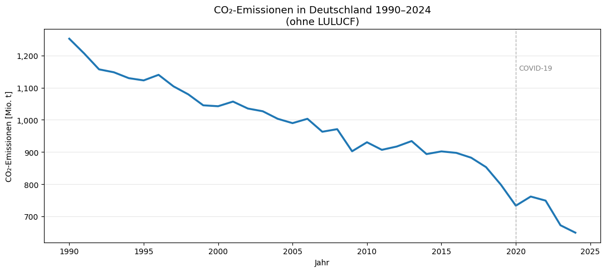
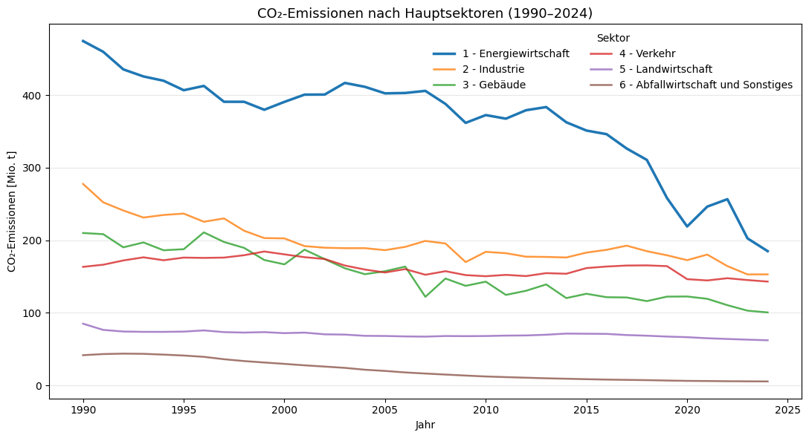

# Treibhausgasemissionen in Deutschland (1990–2024)

## Projektziel

Dieses Projekt analysiert die langfristige Entwicklung der Treibhausgasemissionen in Deutschland und vergleicht die Beiträge der wichtigsten Sektoren gemäß Bundes-Klimaschutzgesetz (KSG).

Im Mittelpunkt stehen Datenaufbereitung, Zeitreihenanalyse und eine nachvollziehbare Interpretation sektoraler Entwicklungen.

## Datenquelle

Die Analyse basiert auf öffentlich zugänglichen Emissionsdaten des **Umweltbundesamtes (UBA)**.

- Datensatz: *Emissionsübersichten nach Sektoren gemäß Bundes-Klimaschutzgesetz (KSG)*
- Zeitraum: **1990–2024**
- Originalformat: Excel
- Einheit der Rohdaten: **Tausend Tonnen CO₂-Äquivalente (kt CO₂e)**
- Einheit der aufbereiteten Analysedaten: **Millionen Tonnen CO₂-Äquivalente (Mt CO₂e)**

> Hinweis: Die Daten beziehen sich auf Treibhausgasemissionen in CO₂-Äquivalenten und nicht ausschließlich auf CO₂.

## Fragestellungen

- Wie haben sich die Treibhausgasemissionen in Deutschland seit 1990 entwickelt?
- Welche KSG-Sektoren tragen am stärksten zu den Emissionen bei?
- Welche Sektoren zeigen die größten langfristigen Rückgänge?
- Wo sind erkennbare Trendbrüche oder außergewöhnliche Jahre sichtbar?

## Methodik

### 1. Datenaufbereitung

- Einlesen der offiziellen Excel-Rohdaten
- Auswahl des relevanten Tabellenblatts
- Entfernung von Meta- und Hilfsspalten
- Bereinigung der Sektorbezeichnungen
- Umwandlung der Jahreswerte vom Wide- ins Long-Format mit `pandas.melt`
- Auswahl der Gesamtwerte und aggregierten KSG-Hauptsektoren
- Umrechnung von **kt CO₂e** in **Mt CO₂e**
- Export eines bereinigten CSV-Datensatzes

### 2. Analyse und Visualisierung

- Entwicklung der nationalen Treibhausgasemissionen ohne LULUCF
- Vergleich der KSG-Hauptsektoren über die Zeit
- Untersuchung langfristiger Veränderungen und auffälliger Zeitpunkte
- Visualisierung mit Matplotlib

## Ergebnisse – Kurzfassung

Die Analyse zeigt einen deutlichen langfristigen Rückgang der deutschen Treibhausgasemissionen seit 1990.

- Die Energiewirtschaft weist über den betrachteten Zeitraum hohe Emissionswerte auf, gleichzeitig aber auch starke absolute Rückgänge.
- Der Verkehrssektor zeigt im Vergleich zu mehreren anderen Sektoren wesentlich geringere langfristige Reduktionen.
- Für 2020 ist ein deutlicher Rückgang sichtbar. Die COVID-19-Pandemie ist ein plausibler Kontextfaktor, aus der deskriptiven Analyse allein lässt sich jedoch keine kausale Wirkung ableiten.
- Auch ab 2022 sind weitere Veränderungen sichtbar. Aussagen über konkrete Ursachen wie Energiekrise oder Veränderungen im Energiemix benötigen zusätzliche externe Evidenz und werden daher nicht allein aus diesem Datensatz abgeleitet.

## Visualisierungen

### Entwicklung der Treibhausgasemissionen in Deutschland



### Treibhausgasemissionen nach KSG-Hauptsektoren



## Projektstruktur

```text
co2-analyse-deutschland/
├── daten/
│   ├── original/
│   │   └── Emissionsübersichten_KSG-Sektoren_1990–2024.xlsx
│   └── aufbereitet/
│       └── thg_emissionen_deutschland.csv
├── notebooks/
│   ├── 01_datenaufbereitung.ipynb
│   └── 02_analyse_und_visualisierung.ipynb
├── visualisierungen/
│   ├── co2_emissionen_hauptsektoren.png
│   └── co2_trend_deutschland.png
├── requirements.txt
└── README.md
```

## Reproduzierbarkeit

Die Notebooks verwenden relative Projektpfade und können entweder aus dem Repository-Root oder direkt aus dem Ordner `notebooks/` ausgeführt werden.

### Installation

```bash
python -m pip install -r requirements.txt
```

Danach:

1. `notebooks/01_datenaufbereitung.ipynb` ausführen
2. `notebooks/02_analyse_und_visualisierung.ipynb` ausführen

Das erste Notebook erzeugt den bereinigten Datensatz im Ordner `daten/aufbereitet/`.

## Verwendete Technologien

- Python
- Pandas
- Matplotlib
- Jupyter Notebook

## Limitationen

- Die Analyse ist deskriptiv und erlaubt keine kausalen Schlussfolgerungen.
- Auffällige zeitliche Veränderungen können mit externen Ereignissen zusammenfallen; mögliche Ursachen müssen mit zusätzlichen Quellen geprüft werden.
- Die Analyse konzentriert sich auf aggregierte KSG-Hauptsektoren und nicht auf sämtliche CRF-Unterkategorien oder einzelne Treibhausgase.
- Die Datenquelle kann nachträglich revidierte historische Werte enthalten.
